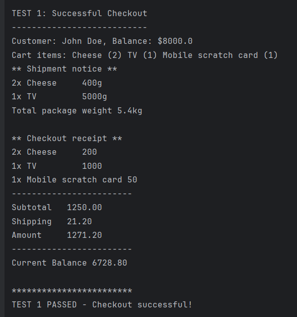
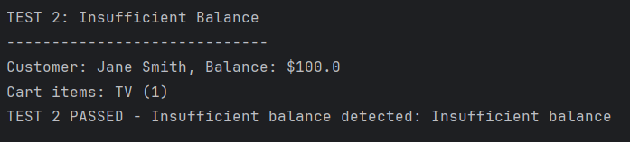
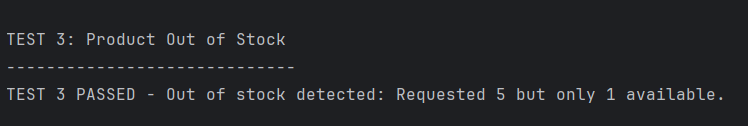
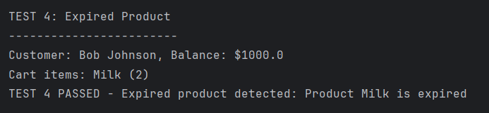
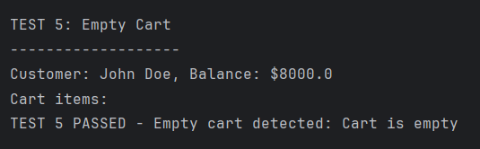
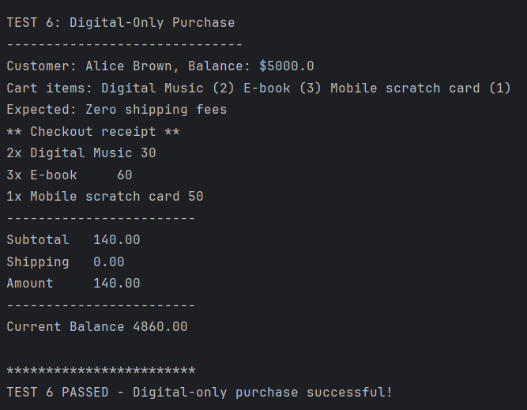
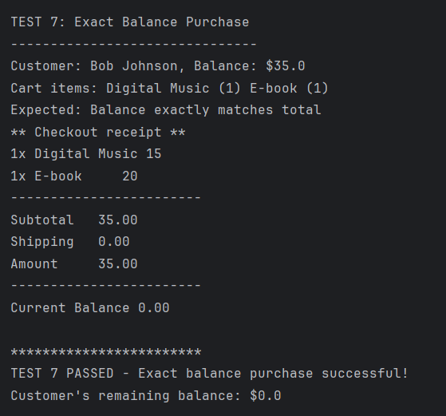
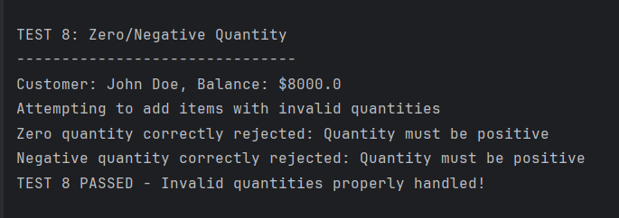

# fawry-rise-internship-challenge


This project is a simple e-commerce system implemented in Java. It provides functionality for managing customers, products, shopping carts, and processing checkouts. The system includes features such as handling shipping fees, validating checkout conditions, and printing receipts. It also includes a set of test cases to verify the functionality of the system.


## Project Structure

```
src/
├── main/
│   ├── java/
│   │   └── com/
│   │       └── ecommerce/
│   │           ├── Main.java
│   │           ├── exception/
│   │           │   ├── EmptyCartException.java
│   │           │   ├── ExpiredProductException.java
│   │           │   ├── InsufficientBalanceException.java
│   │           │   └── OutOfStockException.java
│   │           ├── model/
│   │           │   ├── Cart.java
│   │           │   ├── CartItem.java
│   │           │   ├── Customer.java
│   │           │   ├── Product.java
│   │           │   ├── Shippable.java
│   │           │   └── ShippableProduct.java
│   │           ├── repository/
│   │           │   ├── CustomerRepository.java
│   │           │   └── ProductRepository.java
│   │           ├── service/
│   │           │   ├── CheckoutService.java
│   │           │   ├── CheckoutValidator.java
│   │           │   └── ShippingService.java
│   │           ├── test/
│   │           │   └── ProjectTestCases.java
│   │           └── util/
│   │               └── ReceiptPrinter.java
│   └── resources/
└── test/
    └── java/
```

## How to Run

1. **Clone the Repository**:
   ```bash
   git clone https://github.com/Hemdan47/fawry-rise-internship-challenge.git
   cd fawry-rise-internship-challenge
   ```

2. **Build the Project**:
   Ensure you have Maven installed. Run the following command to build the project:
   ```bash
   mvn clean install
   ```

3. **Run the Application**:
   Execute the `Main` class to run the test cases:
   ```bash
   mvn exec:java -Dexec.mainClass="com.ecommerce.Main"
   ```

4. **Expected Output**:
   The application will run all test cases defined in `ProjectTestCases` and print the results to the console.

## Test Cases

The project includes the following test cases to validate the functionality:

1. **Successful Checkout**: Tests a normal checkout process with sufficient balance and valid products.
2. **Insufficient Balance**: Ensures the system throws an exception when the customer's balance is insufficient.
3. **Product Out of Stock**: Validates that the system detects and handles out-of-stock products.
4. **Expired Product**: Ensures expired products cannot be purchased.
5. **Empty Cart**: Verifies that an empty cart cannot be checked out.
6. **Digital-Only Purchase**: Tests a purchase with only digital products (no shipping fees).
7. **Exact Balance Purchase**: Ensures a customer can make a purchase with a balance that exactly matches the total amount.
8. **Zero/Negative Quantity**: Validates that adding products with zero or negative quantities is not allowed.


## Dependencies

This project uses the following dependencies:

- **Maven**: For build and dependency management.
- **Java 21**: Ensure you have JDK 21 installed.

## Test Cases Output











## License

This project is licensed under the MIT License. See the `LICENSE` file for details.
